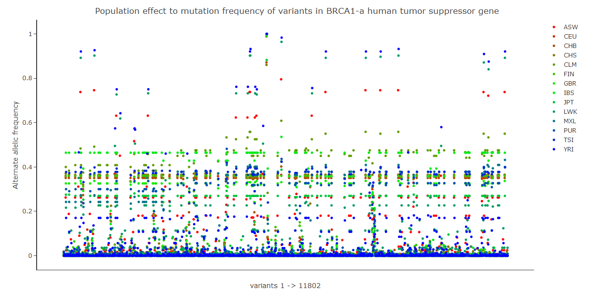

```{r setup, include=FALSE}
knitr::opts_chunk$set(echo = TRUE)
```

## 1000 Genomes: Exploration and Proposal Notebook


```{r}


#head(result)

```


## Population effects to mutation frequency of variants - a case of BRCA1
```{r}

result <- read.csv(gzfile('./output/results-fig2.csv.gz','rt'), header=TRUE, sep=",", stringsAsFactors=FALSE);
head(result)

```


<a href="figures/fig2.html" target="_blank"> Hello, world!</a>


[](figures/fig2.html)


```{r, echo=FALSE}

library(knitr);
library(ggplot2);


```

