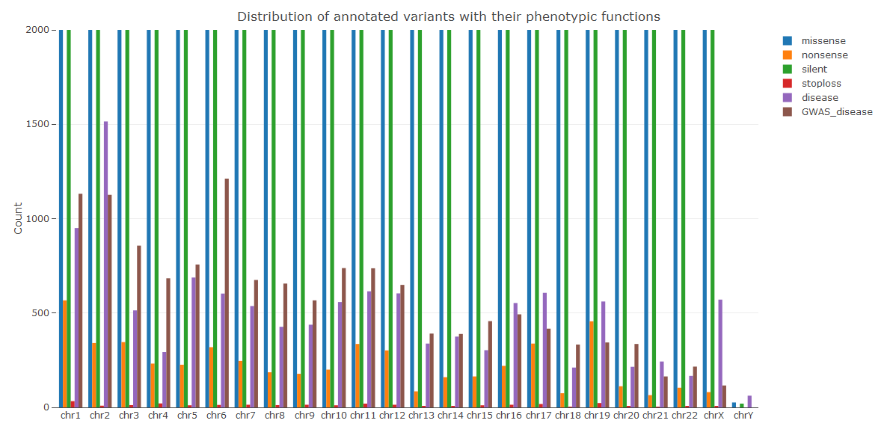

```{r setup, include=FALSE}
knitr::opts_chunk$set(echo = TRUE)
```

## 1000 Genomes: Exploration and Proposal Notebook

The 1000 genomes is among the biggest human genome projects in the world. It is looking at about 2,500 people to systematically find and map human genetic variants across multiple populations. The ultimate goal is creating a complete resource for many disease studies to use immediately and cost savings.
However, among ~40 million variants that are recorded in the first phase of the project, only ~25,000 are annotated to specific disease relevance while majority of the remaining missense variants are left null. And thus in this proposal, we aim to propose a methodology to construct a machine model to learn the annotation from those annotated and predict back to those that are not annotated. The annotation at first can be simply by non-disease or disease-relevant, or if an indel variant is associated with a structural variant or not.


# -


## Distribution of annotated variants with their phenotypic functions
```{r}

result <- read.csv(gzfile('./output/results-fig1.csv.gz','rt'), header=T, sep=",");
head(result)

```


# -


[](figures/fig1.html)


# -


## Population effects to mutation frequency of variants - a case of BRCA1
```{r}

result <- read.csv(gzfile('./output/results-fig2.csv.gz','rt'), header=T, sep=",");
head(result)

```


# -


[](figures/fig2.html)


# -


<iframe width="560" height="315" src="https://www.youtube.com/embed/g5pBItYf1oU" frameborder="0" allow="encrypted-media" allowfullscreen></iframe>


# 


