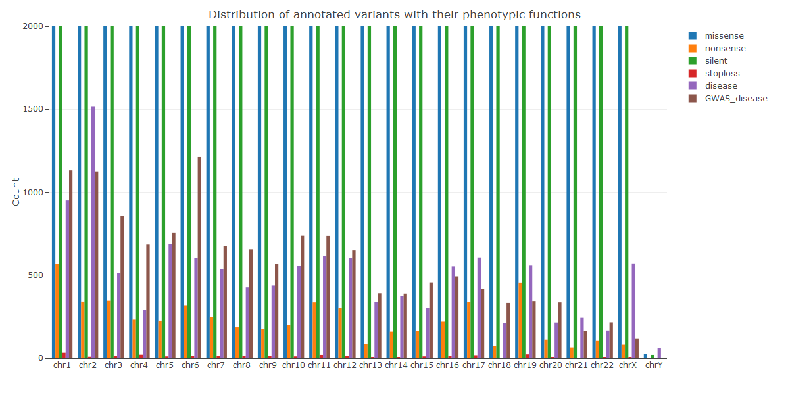

1000 Genomes: Exploration and Proposal Notebook
-----------------------------------------------

The 1000 genomes is among the biggest human genome projects in the world. It is looking at about 2,500 people to systematically find and map human genetic variants across multiple populations. The ultimate goal is creating a complete resource for many disease studies to use immediately and cost savings. However, among ~40 million variants that are recorded in the first phase of the project, only ~25,000 are annotated to specific disease relevance while majority of the remaining missense variants are left null. And thus in this proposal, we aim to propose a methodology to construct a machine model to learn the annotation from those annotated and predict back to those that are not annotated. The annotation at first can be simply by non-disease or disease-relevant, or if an indel variant is associated with a structural variant or not.

-
=

Distribution of annotated variants with their phenotypic functions
------------------------------------------------------------------

``` r
result <- read.csv(gzfile('./output/results-fig1.csv.gz','rt'), header=T, sep=",");
```

    ## Warning in read.table(file = file, header = header, sep = sep, quote =
    ## quote, : seek on a gzfile connection returned an internal error

    ## Warning in read.table(file = file, header = header, sep = sep, quote =
    ## quote, : seek on a gzfile connection returned an internal error

``` r
head(result)
```

    ##   chromosome  start    end reference_bases alternate_bases   Gene
    ## 1          1  69510  69510               A               G  OR4F5
    ## 2          1  69533  69533               T               C  OR4F5
    ## 3          1  69535  69535               C               T  OR4F5
    ## 4          1 865543 865543               C               T SAMD11
    ## 5          1 865544 865544               G               A SAMD11
    ## 6          1 865583 865583               G               A SAMD11
    ##   ExonicFunc ClinVar_DIS GWAS_DIS
    ## 1   missense                     
    ## 2     silent                     
    ## 3   missense                     
    ## 4   missense                     
    ## 5   missense                     
    ## 6   missense

-
=

[](figures/fig1.html)

-
=

Population effects to mutation frequency of variants - a case of BRCA1
----------------------------------------------------------------------

``` r
result <- read.csv(gzfile('./output/results-fig2.csv.gz','rt'), header=T, sep=",");
```

    ## Warning in read.table(file = file, header = header, sep = sep, quote =
    ## quote, : seek on a gzfile connection returned an internal error

    ## Warning in read.table(file = file, header = header, sep = sep, quote =
    ## quote, : seek on a gzfile connection returned an internal error

``` r
head(result)
```

    ##   reference_name    start population reference_bases alt
    ## 1             17 41196362        ASW               C   T
    ## 2             17 41196362        CEU               C   T
    ## 3             17 41196362        CHB               C   T
    ## 4             17 41196362        CHS               C   T
    ## 5             17 41196362        CLM               C   T
    ## 6             17 41196362        FIN               C   T
    ##   num_sample_alleles ref_cnt alt_cnt  ref_freq    alt_freq
    ## 1                122     122       0 1.0000000 0.000000000
    ## 2                170     167       3 0.9823529 0.017647059
    ## 3                194     194       0 1.0000000 0.000000000
    ## 4                200     200       0 1.0000000 0.000000000
    ## 5                120     120       0 1.0000000 0.000000000
    ## 6                186     185       1 0.9946237 0.005376344

-
=

[](figures/fig2.html)

-
=

<iframe width="560" height="315" src="https://www.youtube.com/embed/g5pBItYf1oU" frameborder="0" allow="encrypted-media" allowfullscreen>
</iframe>
